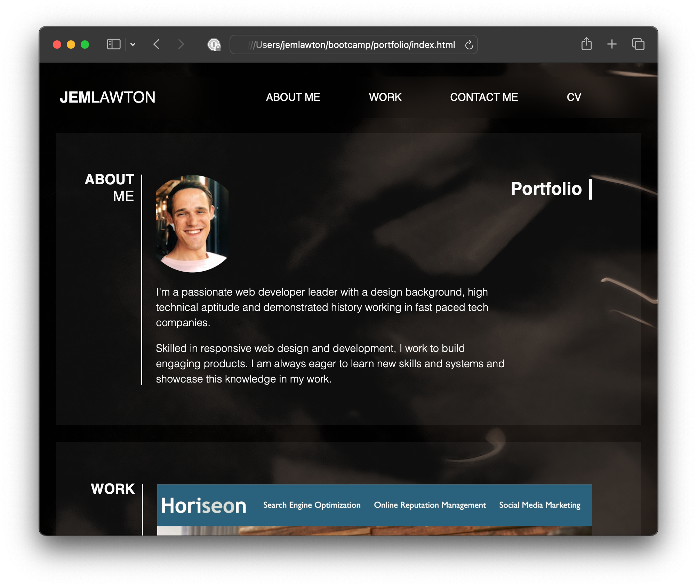

# Front End Bootcamp - Week 2 Challenge - Portfolio

## Description

The purpose of this project was to build a responsive portfolio page that can be added to as the course progresses, highlighting my work to potential employers. 

The aim was to showcase my knowledge in HTML and CSS so far, practice what I have learned and idenitfy and plug any gaps. Additionally, I wanted to to gain further knowledge on the topics beyond what I already knew.

In order to set myself up for future success I decided push myself in terms of design. I wanted to to create something visually appealing that I'd want to continue to use as a blueprint for my portfolio going forward. 

This inevitably threw up some additional coding challenges, especially with regards to the CSS. One of the bigger challanges was how to make CSS grid items interactive by adding hyperlinks - I made a few mistakes here, including incorrectly nesting the elements in the HTML. These challenges have helped me to cement my knowledge of Flexbox and CSS Grids, positioning elements and structuring them within the HTML as well as teaching me some new tricks. I've also learned to use the browsers developer tools to test out new code regularly and work faster.

## Deployed Application

* [Portfolio on GitHub Pages](https://partialarts.github.io/portfolio/)

## Usage

To use this web page, you can open index.html inside a browser. The navigation links will link to the relevant sections of the page. Clicking on the work grid items will open a new window with a link to the relevant project.

To see the code, open the DevTools by pressing Command+Option+I (macOS) or Control+Shift+I (Windows). A console panel should open either below or to the side of the webpage in the browser. There you will see the HTML and CSS code along with comments.

## Screenshot

## Credits

- Placeholder images in work section were provided in the starter code
- All other images, such as the background, are my own.

### External Tutorials and Resources

* [Stack Overflow - How to Make a Background Blur in CSS?](https://www.scaler.com/topics/background-blur-css/) – Used for backdrop-filter in CSS
* [CSS Variables - The var() Function](https://www.w3schools.com/css/css3_variables.asp)
* [Stack Overflow - How to "z-index" to make a menu always on top of the content](https://stackoverflow.com/questions/10507143/how-to-z-index-to-make-a-menu-always-on-top-of-the-content)
* [Stack Overflow - How to add a color overlay to a background image?](https://stackoverflow.com/questions/36679649/how-to-add-a-color-overlay-to-a-background-image) - Used to add colour overlay to page background
* [Creating Fixed Headers with CSS](https://cssdeck.com/blog/creating-fixed-headers-with-css/) - Used for navigation
* [CSS background-attachment Property](https://www.w3schools.com/cssref/pr_background-attachment.php) - Used to fix page background
* [Profile Card Flexbox Tutorial](https://codepen.io/angeladelise/pen/XWmBQoK?editors=1100) - Used to clip profile image with circle
* [A Complete Guide to CSS Grid](https://css-tricks.com/snippets/css/complete-guide-grid/)
* [Media Queries Demystified: CSS Min-Width and Max-Width](https://www.emailonacid.com/blog/article/email-development/emailology_media_queries_demystified_min-width_and_max-width/)

## License

MIT - [See LICENSE file in repo](https://github.com/partialarts/portfolio/blob/main/LICENSE)
